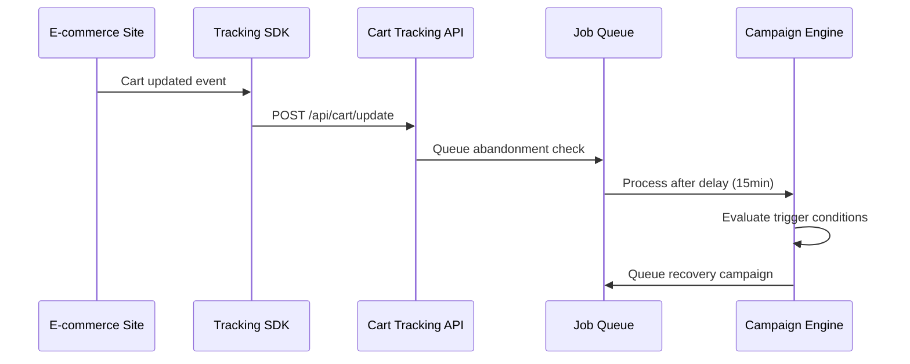
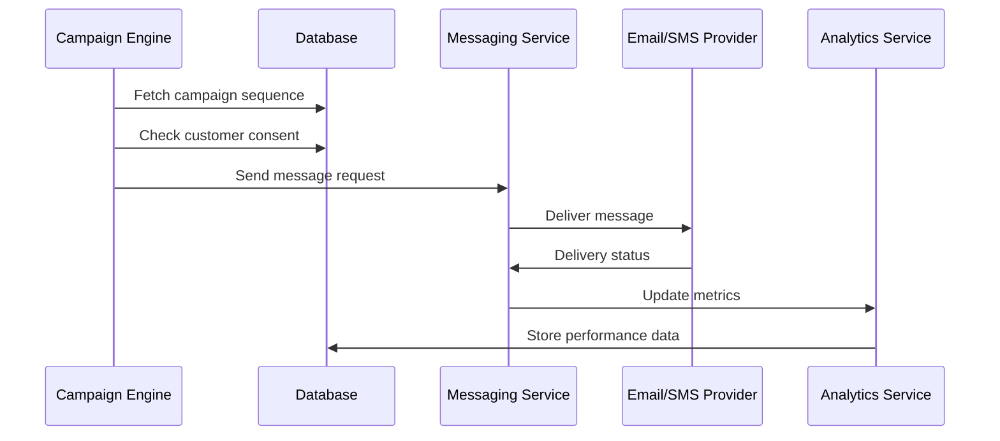

# Abandoned Cart Recovery - System Architecture

## 🏗️ Overview

This document outlines the comprehensive system architecture for the Abandoned Cart Recovery MicroSaaS platform, designed based on industry research and best practices for e-commerce cart recovery solutions.

## 🎯 Design Principles

1. **Event-Driven Architecture**: Real-time cart tracking and campaign automation
2. **Multi-Tenant SaaS**: Store-level isolation with shared infrastructure
3. **Microservices Design**: Scalable, maintainable service separation
4. **API-First Approach**: Comprehensive REST APIs with webhook support
5. **Compliance by Design**: GDPR and TCPA compliance built-in
6. **Performance Optimized**: Sub-second response times and 99.9% uptime

## 🔧 Technology Stack

### Frontend
- **Framework**: Next.js 14 with App Router
- **Language**: TypeScript
- **Styling**: Tailwind CSS with shadcn/ui components
- **State Management**: Zustand for global state
- **Data Fetching**: TanStack Query (React Query)
- **Charts**: Chart.js and Recharts for analytics
- **Real-time**: WebSocket connections for live updates

### Backend
- **Runtime**: Node.js with Express.js
- **Language**: TypeScript
- **Database**: PostgreSQL with Prisma ORM
- **Cache**: Redis for sessions and real-time data
- **Queue**: Bull for background job processing
- **Authentication**: NextAuth.js with multiple providers
- **Email**: SendGrid for email delivery
- **SMS**: Twilio for SMS messaging

### Infrastructure
- **Containerization**: Docker with multi-stage builds
- **Orchestration**: Docker Compose for development
- **Cloud**: AWS/GCP deployment ready
- **CDN**: CloudFlare for static assets
- **Monitoring**: Built-in observability with metrics

## 🗄️ Database Schema Design

### Core Entities

#### Organizations (Multi-Tenant)
```sql
organizations {
  id: uuid (PK)
  name: string
  industry: string?
  timezone: string (default: UTC)
  settings: jsonb (GDPR preferences, email limits)
  subscription_plan: enum
  created_at: timestamp
  updated_at: timestamp
}
```

#### Stores (E-commerce Platform Connections)
```sql
stores {
  id: uuid (PK)
  organization_id: uuid (FK)
  platform: enum (SHOPIFY, WOOCOMMERCE, BIGCOMMERCE, MAGENTO)
  store_name: string
  store_url: string
  api_credentials: jsonb (encrypted)
  webhook_secret: string
  sync_status: enum (ACTIVE, ERROR, SYNCING)
  last_sync: timestamp?
  settings: jsonb (tracking preferences, recovery timing)
  created_at: timestamp
  updated_at: timestamp
}
```

#### Customers
```sql
customers {
  id: uuid (PK)
  store_id: uuid (FK)
  external_id: string (platform customer ID)
  email: string
  phone: string?
  first_name: string?
  last_name: string?
  total_orders: integer (default: 0)
  total_spent: decimal (default: 0)
  consent_email: boolean (default: false)
  consent_sms: boolean (default: false)
  opt_out_email: boolean (default: false)
  opt_out_sms: boolean (default: false)
  last_activity: timestamp?
  metadata: jsonb (preferences, segments)
  created_at: timestamp
  updated_at: timestamp
}
```

#### Abandoned Carts
```sql
abandoned_carts {
  id: uuid (PK)
  store_id: uuid (FK)
  customer_id: uuid (FK)
  external_cart_id: string (platform cart ID)
  session_id: string?
  cart_url: string
  cart_value: decimal
  cart_items: jsonb (product details, images, prices)
  abandoned_at: timestamp
  recovered: boolean (default: false)
  recovered_at: timestamp?
  recovery_revenue: decimal?
  recovery_method: enum? (EMAIL, SMS, DIRECT)
  metadata: jsonb (device, browser, referrer)
  created_at: timestamp
  updated_at: timestamp
}
```

#### Campaigns (Recovery Sequences)
```sql
campaigns {
  id: uuid (PK)
  store_id: uuid (FK)
  name: string
  description: string?
  type: enum (AUTOMATED, MANUAL)
  status: enum (ACTIVE, PAUSED, DRAFT)
  trigger_conditions: jsonb (cart value, customer segment)
  sequence_steps: jsonb (timing, channels, templates)
  performance_metrics: jsonb (sent, opened, clicked, converted)
  created_at: timestamp
  updated_at: timestamp
}
```

#### Messages (Sent Communications)
```sql
messages {
  id: uuid (PK)
  campaign_id: uuid (FK)
  cart_id: uuid (FK)
  customer_id: uuid (FK)
  step_index: integer
  channel: enum (EMAIL, SMS, PUSH)
  template_id: uuid?
  subject: string?
  content: text
  status: enum (QUEUED, SENT, DELIVERED, OPENED, CLICKED, FAILED)
  sent_at: timestamp?
  opened_at: timestamp?
  clicked_at: timestamp?
  error_message: string?
  metadata: jsonb (tracking pixels, click URLs)
  created_at: timestamp
  updated_at: timestamp
}
```

#### Templates (Email/SMS Templates)
```sql
templates {
  id: uuid (PK)
  store_id: uuid (FK)
  name: string
  type: enum (EMAIL, SMS)
  subject: string? (for email)
  html_content: text?
  text_content: text
  variables: jsonb (available placeholders)
  design_config: jsonb (styling, layout)
  preview_data: jsonb (sample data for preview)
  is_default: boolean (default: false)
  created_at: timestamp
  updated_at: timestamp
}
```

#### Analytics (Performance Tracking)
```sql
analytics {
  id: uuid (PK)
  store_id: uuid (FK)
  date: date
  carts_abandoned: integer
  campaigns_sent: integer
  emails_sent: integer
  sms_sent: integer
  emails_opened: integer
  emails_clicked: integer
  sms_clicked: integer
  carts_recovered: integer
  revenue_recovered: decimal
  recovery_rate: decimal
  avg_time_to_recovery: interval
  created_at: timestamp
}
```

### Indexes for Performance
```sql
-- Cart tracking and recovery
CREATE INDEX idx_abandoned_carts_store_abandoned ON abandoned_carts(store_id, abandoned_at);
CREATE INDEX idx_abandoned_carts_customer ON abandoned_carts(customer_id, abandoned_at);
CREATE INDEX idx_abandoned_carts_recovery ON abandoned_carts(store_id, recovered, abandoned_at);

-- Message delivery and tracking
CREATE INDEX idx_messages_campaign_status ON messages(campaign_id, status, sent_at);
CREATE INDEX idx_messages_customer_channel ON messages(customer_id, channel, sent_at);
CREATE INDEX idx_messages_cart ON messages(cart_id, step_index);

-- Analytics queries
CREATE INDEX idx_analytics_store_date ON analytics(store_id, date);
CREATE INDEX idx_analytics_date_range ON analytics(date) WHERE date >= CURRENT_DATE - INTERVAL '90 days';

-- Customer segmentation
CREATE INDEX idx_customers_consent ON customers(store_id, consent_email, consent_sms);
CREATE INDEX idx_customers_activity ON customers(store_id, last_activity);
```

## 🏛️ Service Architecture

### 1. API Gateway Service
- **Responsibility**: Request routing, authentication, rate limiting
- **Technologies**: Express.js middleware, JWT validation
- **Features**:
  - Store-level API key authentication
  - Request/response logging
  - Rate limiting per store/endpoint
  - CORS handling for dashboard

### 2. Cart Tracking Service
- **Responsibility**: Real-time cart abandonment detection
- **Technologies**: WebSocket, Redis Streams
- **Features**:
  - JavaScript SDK for e-commerce integration
  - Real-time cart event processing
  - Session management and device tracking
  - Exit-intent detection

### 3. Campaign Engine Service
- **Responsibility**: Automated recovery campaign management
- **Technologies**: Bull queue, cron jobs
- **Features**:
  - Multi-step sequence automation
  - Trigger condition evaluation
  - A/B testing framework
  - Campaign performance tracking

### 4. Messaging Service
- **Responsibility**: Multi-channel message delivery
- **Technologies**: SendGrid, Twilio, FCM
- **Features**:
  - Email template rendering
  - SMS delivery with compliance
  - Push notification handling
  - Delivery status tracking

### 5. Integration Service
- **Responsibility**: E-commerce platform connectivity
- **Technologies**: Platform-specific SDKs, webhook processing
- **Features**:
  - Shopify, WooCommerce, BigCommerce APIs
  - Real-time webhook processing
  - Data synchronization
  - Error handling and retry logic

### 6. Analytics Service
- **Responsibility**: Performance metrics and reporting
- **Technologies**: Aggregation queries, caching
- **Features**:
  - Real-time dashboard metrics
  - Campaign performance analysis
  - Revenue attribution
  - Export capabilities

## 🔄 Event-Driven Workflow

### Cart Abandonment Detection


### Recovery Campaign Execution


## 🔒 Security Architecture

### Authentication & Authorization
- **Multi-factor Authentication**: TOTP, SMS, email verification
- **Role-based Access Control**: Owner, Admin, User roles
- **API Security**: JWT tokens, API key authentication
- **Session Management**: Redis-based session storage

### Data Protection
- **Encryption at Rest**: Database encryption, credential encryption
- **Encryption in Transit**: TLS 1.3, certificate pinning
- **Data Minimization**: Only necessary data collection
- **Anonymization**: Customer data anonymization options

### Compliance Framework
- **GDPR Compliance**:
  - Explicit consent management
  - Right to erasure (data deletion)
  - Data portability
  - Breach notification system
  - Privacy by design

- **TCPA Compliance** (SMS):
  - Express written consent
  - Opt-out mechanisms (STOP keywords)
  - Timing restrictions (8 AM - 9 PM)
  - DNC list checking

### Security Monitoring
- **Vulnerability Scanning**: Automated security scans
- **Audit Logging**: Complete activity tracking
- **Intrusion Detection**: Anomaly detection
- **Access Monitoring**: Failed login attempts, suspicious activity

## 📊 Scalability & Performance

### Horizontal Scaling
- **Service Isolation**: Independent service scaling
- **Database Sharding**: Store-based partitioning
- **Read Replicas**: Analytics query optimization
- **CDN Integration**: Static asset delivery

### Caching Strategy
- **Redis Layers**:
  - Session cache (user sessions)
  - Query cache (frequent database queries)
  - Rate limiting cache
  - Real-time metrics cache

### Performance Targets
- **API Response Time**: < 200ms for 95% of requests
- **Cart Tracking**: < 50ms event processing
- **Email Delivery**: < 5 minutes from trigger
- **Dashboard Load**: < 2 seconds initial load
- **Uptime**: 99.9% availability SLA

## 🔧 Integration Architecture

### E-commerce Platform Integration

#### Shopify Integration
```javascript
// Webhook processing for cart updates
const handleShopifyWebhook = async (req, res) => {
  const { cart, customer } = req.body;
  const store = await getStoreByDomain(req.headers['x-shopify-shop-domain']);
  
  await cartTrackingService.updateCart({
    storeId: store.id,
    externalCartId: cart.id,
    customerId: customer.id,
    cartData: cart,
    timestamp: new Date()
  });
};
```

#### WooCommerce Integration
```javascript
// REST API polling for cart data
const syncWooCommerceData = async (store) => {
  const api = new WooCommerceAPI(store.credentials);
  const carts = await api.get('carts', {
    status: 'abandoned',
    modified_after: store.lastSync
  });
  
  for (const cart of carts) {
    await processAbandonedCart(store.id, cart);
  }
};
```

### Webhook Security
- **Signature Verification**: HMAC signature validation
- **Replay Protection**: Timestamp-based replay prevention
- **Rate Limiting**: Per-store webhook rate limits
- **Error Handling**: Exponential backoff retry logic

## 📈 Monitoring & Observability

### Application Metrics
- **Business Metrics**: Recovery rate, revenue recovered, campaign performance
- **Technical Metrics**: Response times, error rates, queue lengths
- **Infrastructure Metrics**: CPU, memory, disk usage
- **Custom Metrics**: Cart abandonment rate, email deliverability

### Logging Strategy
- **Structured Logging**: JSON format with consistent fields
- **Log Levels**: DEBUG, INFO, WARN, ERROR, FATAL
- **Correlation IDs**: Request tracking across services
- **Sensitive Data**: PII redaction in logs

### Alerting Rules
- **Critical Alerts**: Service unavailability, data loss
- **Warning Alerts**: High error rates, performance degradation
- **Info Alerts**: Successful deployments, configuration changes

## 🚀 Deployment Architecture

### Container Strategy
```dockerfile
# Multi-stage build for optimization
FROM node:18-alpine AS builder
WORKDIR /app
COPY package*.json ./
RUN npm ci --only=production

FROM node:18-alpine AS runner
WORKDIR /app
COPY --from=builder /app/node_modules ./node_modules
COPY . .
EXPOSE 3000
CMD ["npm", "start"]
```

### Environment Configuration
- **Development**: Docker Compose with local services
- **Staging**: Cloud deployment with test data
- **Production**: High-availability setup with monitoring

### CI/CD Pipeline
1. **Code Quality**: ESLint, TypeScript checking
2. **Security Scanning**: Vulnerability assessment
3. **Testing**: Unit, integration, e2e tests
4. **Build**: Docker image creation
5. **Deploy**: Rolling deployment with health checks

## 🔍 API Design

### RESTful Endpoints
```
# Cart Management
POST /api/v1/carts/track          # Track cart events
GET  /api/v1/carts/abandoned      # List abandoned carts
POST /api/v1/carts/{id}/recover   # Manual recovery trigger

# Campaign Management
GET    /api/v1/campaigns          # List campaigns
POST   /api/v1/campaigns          # Create campaign
PUT    /api/v1/campaigns/{id}     # Update campaign
DELETE /api/v1/campaigns/{id}     # Delete campaign

# Analytics
GET /api/v1/analytics/dashboard   # Dashboard metrics
GET /api/v1/analytics/performance # Campaign performance
GET /api/v1/analytics/export      # Data export

# Integration
POST /api/v1/integrations         # Add integration
GET  /api/v1/integrations         # List integrations
PUT  /api/v1/integrations/{id}    # Update integration
```

### WebSocket Events
```javascript
// Real-time cart updates
socket.on('cart:abandoned', (data) => {
  // Handle new abandonment
});

socket.on('campaign:sent', (data) => {
  // Handle message sent
});

socket.on('recovery:success', (data) => {
  // Handle successful recovery
});
```

## 🎯 Future Enhancements

### Phase 2 Features
- **Machine Learning**: AI-powered timing optimization
- **Advanced Segmentation**: Behavioral customer clustering
- **Cross-platform Attribution**: Multi-device cart tracking
- **Voice Commerce**: Alexa/Google Assistant integration

### Phase 3 Features
- **International Expansion**: Multi-language, multi-currency
- **Enterprise Features**: Custom domains, white-labeling
- **Advanced Analytics**: Predictive modeling, lifetime value
- **Integration Marketplace**: Third-party app ecosystem

This architecture provides a solid foundation for building a scalable, secure, and feature-rich abandoned cart recovery platform that can compete with industry leaders while maintaining focus on SMB accessibility and transparent pricing.