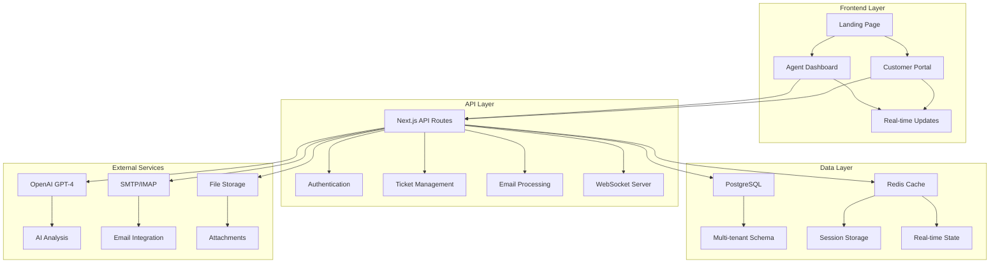
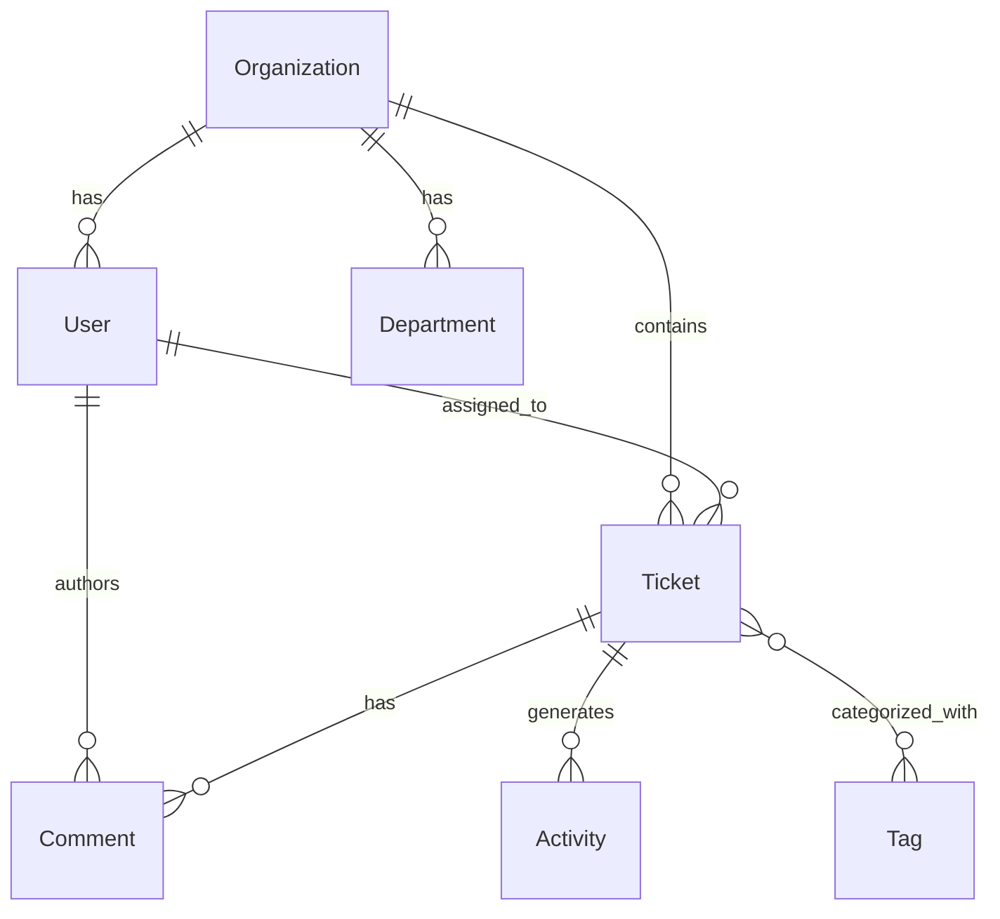

# Architecture Documentation

## System Overview

The Customer Support Ticket System is built as a modern, scalable SaaS platform using Next.js 14 with a multi-tenant architecture. The system is designed to handle enterprise-grade workloads with real-time features, AI automation, and comprehensive email integration.

## High-Level Architecture



## Core Components

### 1. Multi-Tenant Data Architecture

The system implements a shared database, separate schema approach for multi-tenancy:

```typescript
// Every entity includes organizationId for tenant isolation
model Ticket {
  id             String       @id @default(cuid())
  organizationId String       // Tenant isolation
  organization   Organization @relation(fields: [organizationId], references: [id])
  // ... other fields
}
```

**Benefits:**
- Cost-effective resource usage
- Simplified maintenance and updates
- Strong data isolation
- Scalable to thousands of tenants

### 2. Real-time Communication Layer

Built on Socket.IO for bi-directional, real-time communication:

```typescript
// Real-time events
- ticket:updated
- chat:message
- agent:status_update
- notification:new
```

**Features:**
- Live ticket updates
- Real-time chat
- Agent presence indicators
- Instant notifications
- Collaborative editing

### 3. AI Integration Layer

OpenAI GPT-4 integration for intelligent automation:

```typescript
interface TicketAnalysis {
  sentiment: 'positive' | 'negative' | 'neutral'
  category: string
  priority: 'LOW' | 'MEDIUM' | 'HIGH' | 'URGENT'
  urgencyScore: number
  suggestedTags: string[]
  suggestedResponse?: string
  escalationRecommended: boolean
}
```

**Capabilities:**
- Automatic ticket categorization
- Sentiment analysis
- Priority scoring
- Response generation
- Escalation recommendations

### 4. Email Processing Engine

Comprehensive email integration for ticket lifecycle management:

```typescript
// Email processing flow
Incoming Email → Parse Headers → Find/Create Ticket → AI Analysis → Store → Notify
```

**Features:**
- SMTP/IMAP integration
- Email-to-ticket conversion
- Thread tracking
- Attachment handling
- Auto-reply generation

## Database Schema Design

### Core Entities

1. **Organizations** (Tenant Root)
   - Tenant isolation boundary
   - Configuration and settings
   - Subscription management

2. **Users** (Multi-role)
   - Role-based access control
   - Department assignments
   - Authentication data

3. **Tickets** (Core Entity)
   - Full lifecycle management
   - AI analysis results
   - SLA tracking

4. **Comments** (Conversations)
   - Threaded discussions
   - Public/private/internal types
   - File attachments

5. **Activities** (Audit Trail)
   - Complete action history
   - Compliance tracking
   - Analytics source

### Relationships



## Security Architecture

### Authentication & Authorization

1. **NextAuth.js Implementation**
   - Multiple provider support
   - Secure session management
   - JWT token handling

2. **Role-Based Access Control (RBAC)**
   ```typescript
   enum UserRole {
     ADMIN    // Full system access
     MANAGER  // Department management
     AGENT    // Ticket handling
     CUSTOMER // Portal access only
   }
   ```

3. **Multi-Factor Authentication**
   - TOTP support
   - Backup codes
   - Device registration

### Data Protection

1. **Multi-Tenant Isolation**
   - Row-level security
   - Organization-scoped queries
   - Data encryption at rest

2. **API Security**
   - Rate limiting
   - Input validation (Zod)
   - CORS configuration
   - Error sanitization

3. **GDPR Compliance**
   - Data anonymization
   - Right to deletion
   - Data export capabilities
   - Consent management

## Scalability Design

### Horizontal Scaling

1. **Stateless Application Layer**
   - No server-side session storage
   - Load balancer friendly
   - Docker containerization

2. **Database Scaling**
   - Read replicas support
   - Connection pooling
   - Query optimization
   - Proper indexing strategy

3. **Caching Strategy**
   - Redis for session storage
   - API response caching
   - Static asset CDN
   - Database query caching

### Performance Optimizations

1. **Frontend Performance**
   - Code splitting
   - Lazy loading
   - Image optimization
   - Bundle size optimization

2. **API Performance**
   - Efficient database queries
   - Pagination implementation
   - Response compression
   - Proper error handling

3. **Real-time Performance**
   - Connection pooling
   - Event batching
   - Room-based broadcasting
   - Memory-efficient state management

## Deployment Architecture

### Container Strategy

```dockerfile
# Multi-stage build for optimization
FROM node:18-alpine AS base
FROM base AS deps
FROM base AS builder
FROM base AS runner
```

### Infrastructure Components

1. **Application Containers**
   - Next.js application
   - Health check endpoints
   - Graceful shutdown handling

2. **Database Layer**
   - PostgreSQL with persistence
   - Automated backups
   - Migration handling

3. **Cache Layer**
   - Redis for sessions
   - Real-time state storage
   - Queue management

4. **Reverse Proxy**
   - Nginx for SSL termination
   - Load balancing
   - Static file serving

### Environment Management

```yaml
# Development
- Local PostgreSQL
- File-based storage
- Development SSL

# Staging
- Cloud database
- Object storage
- SSL certificates

# Production
- Managed database
- CDN integration
- Enterprise security
```

## API Design

### RESTful Endpoints

```typescript
// Ticket Management
GET    /api/tickets              // List with filters
POST   /api/tickets              // Create new
GET    /api/tickets/[id]         // Get details
PUT    /api/tickets/[id]         // Update
DELETE /api/tickets/[id]         // Delete
POST   /api/tickets/[id]/reply   // Add reply

// Real-time WebSocket
/api/socket                      // Socket.IO endpoint
```

### Error Handling

```typescript
interface ApiError {
  error: string
  details?: unknown
  timestamp: string
  requestId: string
}
```

### Rate Limiting

```typescript
// Rate limits by endpoint
- Authentication: 5 req/min
- Ticket creation: 10 req/min
- General API: 100 req/min
- WebSocket: 1000 events/min
```

## Monitoring & Observability

### Health Checks

```typescript
GET /api/health
{
  status: 'healthy',
  checks: {
    database: 'healthy',
    redis: 'healthy',
    email: 'healthy'
  }
}
```

### Metrics Collection

1. **Application Metrics**
   - Response times
   - Error rates
   - Active users
   - Ticket volume

2. **Infrastructure Metrics**
   - CPU/Memory usage
   - Database performance
   - Network latency
   - Storage utilization

3. **Business Metrics**
   - Customer satisfaction
   - Resolution times
   - Agent productivity
   - SLA compliance

## Development Workflow

### Code Organization

```
src/
├── app/                 # Next.js App Router
│   ├── api/            # API routes
│   ├── dashboard/      # Agent interface
│   └── portal/         # Customer portal
├── components/         # Reusable components
│   ├── ui/            # Base UI components
│   ├── dashboard/     # Dashboard components
│   └── portal/        # Portal components
├── lib/               # Utility libraries
│   ├── auth.ts        # Authentication
│   ├── prisma.ts      # Database client
│   ├── openai.ts      # AI integration
│   └── socket-*.ts    # Real-time features
└── types/             # TypeScript definitions
```

### Testing Strategy

1. **Unit Tests (Jest)**
   - Component testing
   - Utility function testing
   - API route testing

2. **Integration Tests**
   - Database operations
   - External service mocking
   - API endpoint testing

3. **End-to-End Tests (Playwright)**
   - User workflow testing
   - Cross-browser compatibility
   - Mobile responsiveness

### CI/CD Pipeline

```yaml
# GitHub Actions workflow
- Lint and type check
- Run unit tests
- Run integration tests
- Build Docker image
- Deploy to staging
- Run E2E tests
- Deploy to production
```

## Future Architecture Considerations

### Microservices Migration

1. **Service Boundaries**
   - Ticket Service
   - User Service
   - Notification Service
   - Email Service
   - Analytics Service

2. **Communication Patterns**
   - Event-driven architecture
   - Message queues (RabbitMQ/Apache Kafka)
   - Service mesh (Istio)

### Advanced Features

1. **ML/AI Enhancements**
   - Custom model training
   - Predictive analytics
   - Automated testing

2. **Global Distribution**
   - Multi-region deployment
   - Edge computing
   - Data locality compliance

3. **Advanced Real-time**
   - WebRTC for video calls
   - Screen sharing
   - Collaborative editing

This architecture is designed to be production-ready, scalable, and maintainable while following modern best practices for SaaS applications.