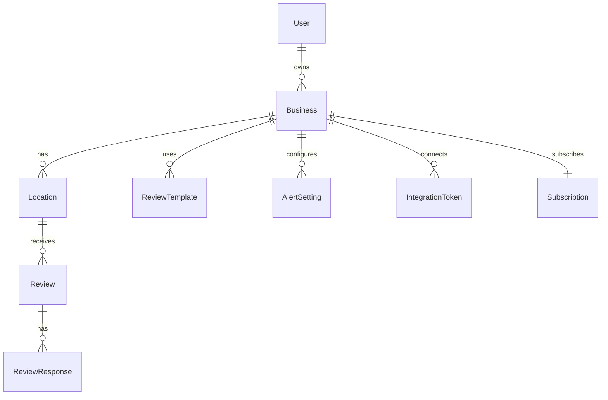

# 🏪 Local Business Review Manager - Enterprise MicroSaaS Platform

[](https://nextjs.org/)
[](https://www.typescriptlang.org/)
[](https://www.prisma.io/)
[](https://redis.io/)
[](https://www.postgresql.org/)
[](https://www.docker.com/)
[](https://opensource.org/licenses/MIT)

A comprehensive, enterprise-grade review management platform for local businesses. Monitor, manage, and respond to reviews across Google, Yelp, Facebook, TripAdvisor, and more from a unified dashboard with AI-powered response generation and advanced analytics.

## 🎯 Overview

The Local Business Review Manager is a complete SaaS solution designed to help local businesses maintain a stellar online reputation. With real-time monitoring, AI-powered responses, and comprehensive analytics, businesses can efficiently manage their reviews across all major platforms.

### Key Features

- **🔍 Multi-Platform Monitoring**: Track reviews across Google My Business, Yelp, Facebook, TripAdvisor, Trustpilot, and more
- **🤖 AI-Powered Responses**: Generate personalized, brand-consistent responses using OpenAI GPT
- **📊 Advanced Analytics**: Sentiment analysis, competitor tracking, and ROI measurement
- **🚨 Real-Time Alerts**: Instant notifications for new reviews and negative feedback
- **👥 Team Collaboration**: Role-based access control and approval workflows  
- **📱 Mobile Responsive**: Full functionality across all devices
- **🔒 Enterprise Security**: GDPR compliance, OWASP security standards, audit logging
- **⚡ High Performance**: Redis caching, optimized queries, auto-scaling ready

## 🏗️ Architecture

### Technology Stack

**Frontend**
- **Next.js 14** - React framework with App Router
- **TypeScript** - Type-safe development
- **Tailwind CSS** - Utility-first styling
- **Radix UI** - Accessible component primitives
- **Framer Motion** - Advanced animations
- **Chart.js** - Analytics visualizations

**Backend**
- **Next.js API Routes** - Serverless API endpoints
- **Prisma ORM** - Type-safe database access
- **PostgreSQL** - Primary database
- **Redis** - Caching and real-time features
- **NextAuth.js** - Authentication and authorization

**Integrations**
- **OpenAI API** - AI response generation
- **Google My Business API** - Review monitoring
- **Yelp Fusion API** - Review data
- **Facebook Graph API** - Social media reviews
- **Twilio** - SMS notifications
- **SendGrid** - Email notifications
- **Stripe** - Subscription billing

**Infrastructure**
- **Docker** - Containerization
- **GitHub Actions** - CI/CD pipeline
- **Vercel/AWS** - Deployment platform
- **Prometheus** - Monitoring
- **Grafana** - Dashboards

### Database Schema



## 🚀 Quick Start

### Prerequisites

- Node.js 18+ 
- PostgreSQL 15+
- Redis 7+
- Docker (optional)

### Environment Setup

1. **Clone the repository**
   ```bash
   git clone <repository-url>
   cd local-business-review-manager
   ```

2. **Install dependencies**
   ```bash
   npm install
   ```

3. **Set up environment variables**
   ```bash
   cp .env.example .env.local
   # Edit .env.local with your configuration
   ```

4. **Initialize the database**
   ```bash
   npx prisma migrate dev
   npx prisma db seed
   ```

5. **Start the development server**
   ```bash
   npm run dev
   ```

6. **Access the application**
   - Frontend: http://localhost:3000
   - API: http://localhost:3000/api
   - Health Check: http://localhost:3000/api/health

### Docker Deployment

1. **Using Docker Compose (Recommended)**
   ```bash
   docker-compose up -d
   ```

2. **Build and run manually**
   ```bash
   docker build -t review-manager .
   docker run -p 3000:3000 review-manager
   ```

## 📋 Configuration

### Environment Variables

| Variable | Description | Default |
|----------|-------------|---------|
| `DATABASE_URL` | PostgreSQL connection string | Required |
| `REDIS_HOST` | Redis host | `localhost` |
| `NEXTAUTH_SECRET` | NextAuth.js secret key | Required |
| `OPENAI_API_KEY` | OpenAI API key for AI features | Optional |
| `GOOGLE_CLIENT_ID` | Google OAuth client ID | Optional |
| `STRIPE_SECRET_KEY` | Stripe secret key for billing | Optional |

See `.env.example` for complete configuration options.

### Platform Integrations

#### Google My Business
1. Create a Google Cloud Project
2. Enable the My Business API
3. Configure OAuth 2.0 credentials
4. Add client ID and secret to environment

#### OpenAI Integration
1. Create an OpenAI account
2. Generate an API key
3. Add to `OPENAI_API_KEY` environment variable

#### Notification Services
- **Twilio**: SMS notifications
- **SendGrid**: Email notifications
- **Webhooks**: Custom integrations

## 🧪 Testing

### Test Coverage Requirements
- **Unit Tests**: 90%+ coverage
- **Integration Tests**: API endpoints and database
- **E2E Tests**: Critical user flows
- **Performance Tests**: Load and stress testing

### Running Tests

```bash
# Unit tests
npm test

# Watch mode
npm run test:watch

# Coverage report
npm run test:coverage

# E2E tests
npm run test:e2e

# All tests
npm run test:all
```

### Test Structure
```
src/
├── __tests__/           # Unit tests
├── components/
│   └── __tests__/       # Component tests
└── app/
    └── api/
        └── __tests__/   # API tests
```

## 📊 Performance & Monitoring

### Performance Metrics
- **Page Load**: < 3 seconds
- **API Response**: < 500ms average
- **Database Queries**: < 100ms average
- **Cache Hit Rate**: > 80%
- **Uptime**: 99.9% target

### Monitoring Stack
- **Application**: Custom metrics with Prometheus
- **Database**: PostgreSQL performance monitoring
- **Cache**: Redis monitoring
- **Error Tracking**: Sentry integration
- **Uptime**: Health check endpoints

### Performance Optimizations
- Redis caching for frequently accessed data
- Database query optimization with Prisma
- Image optimization with Next.js
- Code splitting and lazy loading
- CDN integration for static assets

## 🔒 Security & Compliance

### Security Features
- **Authentication**: Multi-provider OAuth + JWT
- **Authorization**: Role-based access control (RBAC)
- **Data Encryption**: At rest and in transit
- **Input Validation**: Zod schema validation
- **Rate Limiting**: Redis-based rate limiting
- **CSRF Protection**: Built-in Next.js protection
- **Security Headers**: Comprehensive HTTP headers

### GDPR Compliance
- **Data Export**: Complete user data export
- **Data Deletion**: Secure data removal
- **Consent Management**: User consent tracking
- **Audit Logging**: All data access logged
- **Privacy Controls**: Granular privacy settings

### Security Testing
- **Vulnerability Scanning**: Automated security scans
- **Penetration Testing**: Regular security audits
- **Code Analysis**: Static security analysis
- **Dependency Scanning**: Automated dependency checks

## 🚀 Deployment

### Production Deployment

#### Vercel (Recommended)
1. Connect GitHub repository
2. Configure environment variables
3. Deploy automatically on push

#### Docker + AWS/GCP
1. Build container: `docker build -t review-manager .`
2. Push to registry: `docker push <registry>/review-manager`
3. Deploy with Kubernetes or ECS

#### Manual Deployment
1. Build application: `npm run build`
2. Start production server: `npm start`
3. Configure reverse proxy (Nginx)

### CI/CD Pipeline

GitHub Actions workflow:
- **Build**: Compile TypeScript and Next.js
- **Test**: Run unit, integration, and E2E tests
- **Security**: Vulnerability scanning
- **Deploy**: Automatic deployment to staging/production

### Infrastructure Requirements

#### Minimum Requirements
- **CPU**: 2 vCPUs
- **RAM**: 4GB
- **Storage**: 20GB SSD
- **Bandwidth**: 1Gbps

#### Recommended Production
- **CPU**: 4+ vCPUs
- **RAM**: 8GB+
- **Storage**: 100GB+ SSD
- **Database**: Managed PostgreSQL
- **Cache**: Managed Redis
- **CDN**: Global CDN distribution

## 📚 API Documentation

### Core Endpoints

#### Authentication
- `POST /api/auth/register` - User registration
- `POST /api/auth/login` - User login
- `GET /api/auth/session` - Get current session

#### Business Management
- `GET /api/businesses` - List businesses
- `POST /api/businesses` - Create business
- `PUT /api/businesses/:id` - Update business
- `DELETE /api/businesses/:id` - Delete business

#### Review Management
- `GET /api/reviews` - List reviews (with filters)
- `POST /api/reviews` - Create review
- `PUT /api/reviews/:id` - Update review
- `POST /api/reviews/:id/respond` - Respond to review

#### Analytics
- `GET /api/analytics/summary` - Business analytics summary
- `GET /api/analytics/sentiment` - Sentiment analysis
- `GET /api/analytics/competitors` - Competitor analysis

### API Response Format
```json
{
  "success": true,
  "data": {},
  "message": "Operation completed successfully",
  "timestamp": "2024-01-15T10:30:00Z"
}
```

### Error Handling
```json
{
  "success": false,
  "error": "Error message",
  "code": "ERROR_CODE",
  "details": {},
  "timestamp": "2024-01-15T10:30:00Z"
}
```

## 🤝 Contributing

### Development Workflow
1. Fork the repository
2. Create feature branch: `git checkout -b feature/new-feature`
3. Make changes with tests
4. Run tests: `npm test`
5. Commit changes: `git commit -m "feat: add new feature"`
6. Push branch: `git push origin feature/new-feature`
7. Create Pull Request

### Code Standards
- **TypeScript**: Strict mode enabled
- **ESLint**: Airbnb configuration
- **Prettier**: Code formatting
- **Husky**: Pre-commit hooks
- **Conventional Commits**: Commit message format

### Pull Request Requirements
- [ ] All tests pass
- [ ] 90%+ test coverage maintained
- [ ] TypeScript types defined
- [ ] Documentation updated
- [ ] Performance impact assessed
- [ ] Security implications reviewed

## 📈 Roadmap

### Phase 1: Foundation (Complete)
- [x] Core review management system
- [x] Multi-platform integration architecture
- [x] User authentication and authorization
- [x] Basic dashboard and analytics

### Phase 2: AI & Automation (In Progress)
- [ ] OpenAI integration for response generation
- [ ] Advanced sentiment analysis
- [ ] Automated review invitation campaigns
- [ ] Smart alert system

### Phase 3: Enterprise Features
- [ ] White-label solutions
- [ ] Advanced team management
- [ ] Custom integrations API
- [ ] Enterprise reporting

### Phase 4: Scale & Optimization
- [ ] Multi-region deployment
- [ ] Advanced caching strategies
- [ ] Machine learning insights
- [ ] Mobile applications

## 🆘 Support & Documentation

### Getting Help
- **Documentation**: [docs.reviewmaster.com](https://docs.reviewmaster.com)
- **GitHub Issues**: Bug reports and feature requests
- **Community**: [Discord Community](https://discord.gg/reviewmaster)
- **Email**: support@reviewmaster.com

### Troubleshooting

#### Common Issues
1. **Database Connection**: Check DATABASE_URL and PostgreSQL status
2. **Redis Connection**: Verify Redis host and port configuration
3. **Build Failures**: Clear node_modules and reinstall dependencies
4. **API Errors**: Check environment variables and API keys

#### Debug Mode
```bash
DEBUG=* npm run dev  # Enable debug logging
```

#### Health Checks
- Application: `GET /api/health`
- Database: `GET /api/health/database`
- Redis: `GET /api/health/redis`

## 📄 License

This project is licensed under the MIT License - see the [LICENSE](LICENSE) file for details.

## 🙏 Acknowledgments

- **Next.js Team** - Amazing React framework
- **Prisma Team** - Excellent ORM and database toolkit
- **Vercel** - Deployment and hosting platform
- **Tailwind CSS** - Utility-first CSS framework
- **Radix UI** - Accessible component primitives
- **Open Source Community** - Countless contributions

---

**Built with ❤️ for local businesses worldwide**

*Last updated: January 2024*