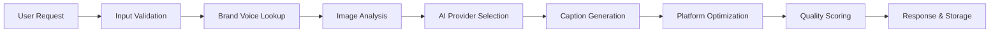
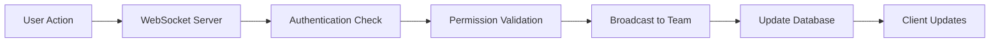

# 🏗️ System Architecture - Social Media Caption Generator

## Overview

This document outlines the technical architecture of the Social Media Caption Generator, an enterprise-grade SaaS platform designed for scalability, security, and performance.

## 🎯 Architecture Principles

### 1. **Security First**
- Zero-trust security model
- End-to-end encryption for sensitive data
- RBAC with principle of least privilege
- GDPR compliance by design

### 2. **Scalability & Performance**
- Horizontal scaling capabilities
- Microservices-ready architecture
- Intelligent caching strategies
- Optimized database queries

### 3. **Reliability & Monitoring**
- Comprehensive error handling
- Real-time monitoring and alerting
- Distributed tracing
- Circuit breaker patterns

### 4. **Developer Experience**
- Type-safe development with TypeScript
- Comprehensive testing framework
- Clear separation of concerns
- Well-documented APIs

## 🏠 System Overview

```
┌─────────────────────────────────────────────────────────────────────────┐
│                            Load Balancer / CDN                          │
└─────────────────────────────┬───────────────────────────────────────────┘
                              │
┌─────────────────────────────┴───────────────────────────────────────────┐
│                        Next.js Application                              │
│  ┌─────────────────┐  ┌─────────────────┐  ┌─────────────────┐        │
│  │   Web Client    │  │   API Routes    │  │  Server Actions  │        │
│  │   (React)       │  │   (REST/tRPC)   │  │  (Server Side)   │        │
│  └─────────────────┘  └─────────────────┘  └─────────────────┘        │
└─────────────────────────────┬───────────────────────────────────────────┘
                              │
┌─────────────────────────────┴───────────────────────────────────────────┐
│                         Service Layer                                   │
│  ┌─────────────────┐  ┌─────────────────┐  ┌─────────────────┐        │
│  │   AI Service    │  │  Brand Voice    │  │ Platform Optimizer │       │
│  │                 │  │   Service       │  │                 │        │
│  └─────────────────┘  └─────────────────┘  └─────────────────┘        │
│  ┌─────────────────┐  ┌─────────────────┐  ┌─────────────────┐        │
│  │ Image Analysis  │  │ Real-time Svc   │  │  Security Svc   │        │
│  │                 │  │                 │  │                 │        │
│  └─────────────────┘  └─────────────────┘  └─────────────────┘        │
└─────────────────────────────┬───────────────────────────────────────────┘
                              │
┌─────────────────────────────┴───────────────────────────────────────────┐
│                       Data & External Services                          │
│  ┌─────────────────┐  ┌─────────────────┐  ┌─────────────────┐        │
│  │   PostgreSQL    │  │     Redis       │  │    Pinecone     │        │
│  │   (Primary DB)  │  │   (Cache/RT)    │  │  (Vector DB)    │        │
│  └─────────────────┘  └─────────────────┘  └─────────────────┘        │
│  ┌─────────────────┐  ┌─────────────────┐  ┌─────────────────┐        │
│  │   OpenAI API    │  │ Anthropic API   │  │  Google AI API  │        │
│  │                 │  │                 │  │                 │        │
│  └─────────────────┘  └─────────────────┘  └─────────────────┘        │
└─────────────────────────────────────────────────────────────────────────┘
```

## 🔧 Core Components

### 1. **Frontend Layer (Next.js App Router)**

#### **Client Components**
- **Dashboard**: Real-time metrics and caption management
- **Generator**: AI-powered caption creation interface
- **Brand Voices**: Voice training and management
- **Analytics**: Performance tracking and insights
- **Settings**: User preferences and team management

#### **Server Components**
- **Data Fetching**: Server-side data loading with caching
- **Authentication**: Session management and route protection
- **SEO Optimization**: Meta tags and structured data

#### **API Routes**
```typescript
/api/
├── captions/
│   ├── generate          # POST - Generate new captions
│   ├── [id]             # GET, PUT, DELETE - CRUD operations
│   └── analytics        # GET - Performance metrics
├── brand-voices/
│   ├── /                # GET, POST - List and create
│   ├── [id]            # GET, PUT, DELETE - CRUD operations
│   └── train           # POST - Train brand voice
├── auth/
│   ├── [...nextauth]   # NextAuth.js endpoints
│   └── session         # GET - Current session
├── subscriptions/
│   ├── checkout        # POST - Create checkout session
│   ├── portal          # POST - Billing portal
│   └── webhooks        # POST - Stripe webhooks
└── health              # GET - System health check
```

### 2. **Service Layer**

#### **AI Service (`src/services/ai-service.ts`)**
- **Multi-Provider Support**: OpenAI, Anthropic, Google Gemini
- **Intelligent Routing**: Cost and complexity-based provider selection
- **Error Handling**: Automatic failover and retry logic
- **Cost Tracking**: Real-time usage and cost monitoring

```typescript
interface AIService {
  generateCaptions(options: GenerationOptions): Promise<GenerationResult>
  analyzeBrandVoice(examples: string[]): Promise<string[]>
  analyzeImageForContext(imageUrl: string): Promise<string>
}
```

#### **Platform Optimizer (`src/services/platform-optimizer.ts`)**
- **Platform Constraints**: Character limits, hashtag rules, format requirements
- **Content Optimization**: Smart truncation, hashtag suggestions
- **Quality Scoring**: 100-point optimization scoring system
- **Trend Integration**: Trending hashtags and topics

#### **Brand Voice Service (`src/services/brand-voice-service.ts`)**
- **Vector Embeddings**: Semantic similarity matching with Pinecone
- **Voice Training**: AI-powered personality and tone analysis
- **Consistency Checking**: Brand voice compliance scoring
- **Multi-Brand Support**: Organization-level brand management

#### **Image Analysis Service (`src/services/image-analysis-service.ts`)**
- **Dual-Service Approach**: Google Vision API + OpenAI GPT-4V
- **Comprehensive Analysis**: Objects, faces, text, colors, emotions
- **Context Generation**: Detailed descriptions for caption generation
- **Caching Strategy**: Optimized storage and retrieval

#### **Real-time Service (`src/services/realtime-service.ts`)**
- **WebSocket Management**: Socket.IO server with authentication
- **Collaboration Features**: Live editing, user presence, activity feeds
- **Progress Tracking**: Real-time generation progress updates
- **Notification System**: In-app notifications and alerts

### 3. **Data Layer**

#### **Database Design (PostgreSQL + Prisma)**

```sql
-- Core Entities
Users ──┐
        ├── Subscriptions
        ├── BrandVoices (with vector embeddings)
        ├── Captions
        ├── Generations
        └── Notifications

Organizations ──┐
                ├── OrganizationMembers
                ├── BrandVoices (shared)
                ├── Captions (team)
                └── AuditLogs

-- Analytics & Tracking
CaptionAnalytics ──> Captions
AuditLogs ──> Users/Organizations
ApiKeys ──> Users/Organizations
```

#### **Caching Strategy (Redis)**
- **Session Storage**: NextAuth.js sessions
- **Rate Limiting**: API request throttling
- **Generated Content**: Temporary caption storage
- **User Preferences**: Fast profile data access
- **Real-time Data**: WebSocket session management

#### **Vector Database (Pinecone)**
- **Brand Voice Embeddings**: Semantic similarity search
- **Content Matching**: Similar caption recommendations
- **Trend Analysis**: Topic clustering and analysis

### 4. **Security Layer**

#### **Authentication & Authorization**
```typescript
// Role-based access control
enum UserRole {
  USER,        // Basic caption generation
  ADMIN,       // Organization management
  SUPER_ADMIN  // System administration
}

// Resource permissions
interface Permission {
  resource: string;    // 'caption', 'brandvoice', 'organization'
  action: string;      // 'create', 'read', 'update', 'delete'
  scope: 'own' | 'any'; // Resource ownership scope
}
```

#### **Data Encryption**
- **AES-256-GCM**: Sensitive data encryption at rest
- **TLS 1.3**: Data in transit encryption
- **JWT Tokens**: Secure session management
- **API Keys**: Encrypted external service credentials

#### **GDPR Compliance**
- **Data Portability**: Complete user data export
- **Right to Erasure**: Automated data deletion
- **Audit Logging**: Comprehensive access tracking
- **Retention Policies**: Automatic data expiration

### 5. **Monitoring & Observability**

#### **Metrics Collection**
```typescript
// Performance metrics
interface PerformanceMetric {
  name: string;
  value: number;
  unit: 'ms' | 'bytes' | 'count' | 'percent';
  timestamp: Date;
  tags?: Record<string, string>;
}

// Business metrics
interface BusinessMetric {
  name: string;
  value: number;
  userId?: string;
  organizationId?: string;
  metadata?: any;
  timestamp: Date;
}
```

#### **Alert System**
- **Threshold-based**: Error rates, response times, costs
- **Anomaly Detection**: Unusual usage patterns
- **Security Events**: Failed logins, privilege escalation
- **Business KPIs**: Churn rate, usage drops

## 🔄 Data Flow Architecture

### 1. **Caption Generation Flow**



### 2. **Real-time Collaboration Flow**



### 3. **Analytics Pipeline**

```mermaid
graph LR
    A[User Events] --> B[Event Collection]
    B --> C[Data Processing]
    C --> D[Metric Aggregation]
    D --> E[Storage (TSDB)]
    E --> F[Dashboard Updates]
```

## 🚀 Deployment Architecture

### **Container Strategy**

```dockerfile
# Multi-stage Docker build
FROM node:18-alpine AS deps
# Dependencies installation

FROM node:18-alpine AS builder
# Application build

FROM node:18-alpine AS runner
# Production runtime
```

### **Service Orchestration (Docker Compose)**

```yaml
services:
  app:           # Next.js application
  postgres:      # Primary database
  redis:         # Cache and real-time
  nginx:         # Reverse proxy
  prometheus:    # Metrics collection
  grafana:       # Visualization
  loki:          # Log aggregation
```

### **Scaling Strategy**

#### **Horizontal Scaling**
- **Application**: Multiple Next.js instances behind load balancer
- **Database**: Read replicas with connection pooling
- **Cache**: Redis cluster for high availability
- **AI Services**: Provider-level load balancing and failover

#### **Vertical Scaling**
- **Memory**: Optimized for AI model inference
- **CPU**: Multi-core processing for concurrent generations
- **Storage**: SSD-backed databases with automatic backup

## 🔍 Performance Optimizations

### **Frontend Optimizations**
- **Server-Side Rendering**: Improved SEO and initial load times
- **Code Splitting**: Lazy loading of components and routes
- **Image Optimization**: Next.js automatic image optimization
- **Caching**: Static asset caching with CDN

### **Backend Optimizations**
- **Database Indexing**: Optimized queries with proper indexes
- **Connection Pooling**: Efficient database connection management
- **Caching Layers**: Multi-level caching strategy
- **API Rate Limiting**: Prevent abuse and ensure fair usage

### **AI Optimizations**
- **Provider Selection**: Cost and performance-based routing
- **Prompt Engineering**: Optimized prompts for better results
- **Response Caching**: Cache similar requests
- **Batch Processing**: Group similar requests for efficiency

## 🛡️ Security Architecture

### **Security Layers**

1. **Network Security**
   - HTTPS/TLS encryption
   - CORS policies
   - Rate limiting
   - DDoS protection

2. **Application Security**
   - Input validation and sanitization
   - XSS protection
   - CSRF tokens
   - Content Security Policy

3. **Authentication Security**
   - Multi-factor authentication
   - OAuth 2.0 / OIDC
   - JWT with refresh tokens
   - Session management

4. **Data Security**
   - Encryption at rest and in transit
   - Database access controls
   - API key management
   - Audit logging

### **Compliance Framework**

- **GDPR**: Data protection and privacy rights
- **SOC 2**: Security, availability, and confidentiality
- **OWASP**: Web application security standards
- **ISO 27001**: Information security management

## 📈 Scalability Considerations

### **Current Limits**
- **Concurrent Users**: 10,000+ with current architecture
- **Daily Generations**: 1M+ captions per day
- **Data Storage**: 1TB+ with optimization strategies
- **Response Time**: <3 seconds average generation time

### **Scaling Roadmap**

#### **Phase 1: Current Architecture** (0-10K users)
- Single-region deployment
- Managed database services
- CDN for static assets

#### **Phase 2: Multi-Region** (10K-100K users)
- Geographic load balancing
- Regional database replicas
- Edge computing for AI inference

#### **Phase 3: Microservices** (100K-1M users)
- Service decomposition
- Event-driven architecture
- Container orchestration (Kubernetes)

#### **Phase 4: Global Scale** (1M+ users)
- Multi-cloud deployment
- Advanced AI optimization
- Real-time global synchronization

## 🔧 Development & Deployment

### **Development Workflow**

1. **Local Development**: Docker Compose setup with hot reloading
2. **Testing**: Comprehensive test suite with 90%+ coverage
3. **Code Quality**: ESLint, Prettier, TypeScript strict mode
4. **Security Scanning**: Automated vulnerability detection

### **CI/CD Pipeline**

1. **Source Control**: Git with branch protection rules
2. **Testing**: Unit, integration, and E2E test automation
3. **Building**: Multi-stage Docker builds with optimization
4. **Deployment**: Rolling updates with health checks
5. **Monitoring**: Automated alerting and rollback capabilities

### **Environment Management**

- **Development**: Local Docker environment with mock services
- **Staging**: Production-like environment for testing
- **Production**: High-availability deployment with monitoring

This architecture provides a solid foundation for a scalable, secure, and maintainable social media caption generation platform that can grow from startup to enterprise scale.