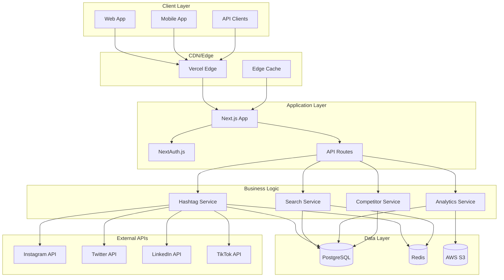
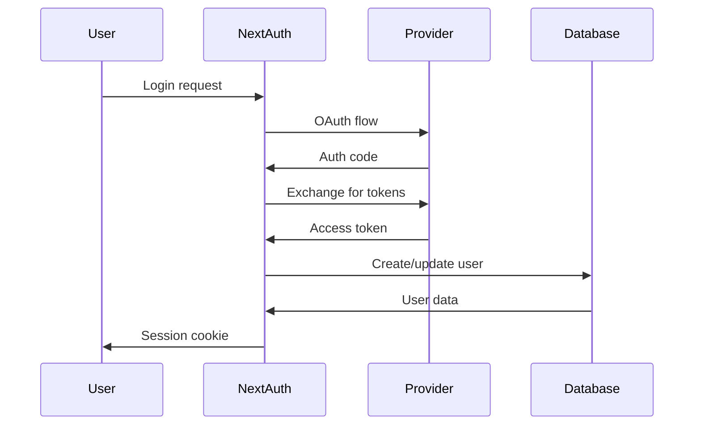

# HashtagPro Architecture Documentation

## 🏗️ System Architecture Overview

HashtagPro is built as a modern, scalable web application using a microservices-inspired architecture with a monolithic deployment strategy for simplicity and cost-effectiveness.



## 🎯 Design Principles

### 1. **Scalability First**
- Horizontal scaling capabilities
- Stateless application design
- Efficient caching strategies
- Database optimization

### 2. **Security by Design**
- OWASP compliance
- Defense in depth
- Least privilege access
- Data encryption

### 3. **Performance Optimization**
- Sub-second response times
- Efficient database queries
- CDN utilization
- Edge computing

### 4. **Developer Experience**
- Type safety with TypeScript
- Comprehensive testing
- Clear documentation
- Easy local development

## 🏛️ Technical Architecture

### Frontend Architecture

```typescript
// Component Structure
src/
├── app/                    # Next.js App Router
│   ├── (auth)/            # Auth group routes
│   ├── dashboard/         # Dashboard pages
│   ├── api/              # API routes
│   └── globals.css       # Global styles
├── components/           # Reusable components
│   ├── ui/              # Base UI components
│   ├── dashboard/       # Dashboard components
│   └── providers.tsx    # Context providers
├── lib/                 # Utilities and configs
│   ├── auth.ts         # Authentication config
│   ├── prisma.ts       # Database client
│   └── utils.ts        # Utility functions
└── types/              # TypeScript definitions
```

### Backend Architecture

#### API Layer
- **Next.js API Routes**: RESTful endpoints
- **Route Handlers**: Type-safe request/response handling
- **Middleware**: Authentication, rate limiting, CORS
- **Validation**: Zod schemas for request validation

#### Business Logic Layer
- **Service Classes**: Encapsulated business logic
- **Repository Pattern**: Data access abstraction
- **Event Handling**: Asynchronous processing
- **Caching Strategy**: Redis-based caching

#### Data Access Layer
- **Prisma ORM**: Type-safe database operations
- **Connection Pooling**: Efficient database connections
- **Migrations**: Version-controlled schema changes
- **Indexing Strategy**: Optimized query performance

## 🗄️ Database Design

### Schema Overview

```prisma
// Core entities relationship
User ||--o{ HashtagSearch : performs
User ||--o{ HashtagSet : creates
User ||--o{ CompetitorTrack : monitors
User ||--o{ UserAnalytics : generates

Hashtag ||--o{ HashtagHistory : has
Hashtag ||--o{ HashtagSetItem : included_in
Hashtag ||--o{ CompetitorHashtag : used_by

HashtagSet ||--o{ HashtagSetItem : contains
CompetitorTrack ||--o{ CompetitorHashtag : tracks
CompetitorTrack ||--o{ CompetitorAnalytics : generates
```

### Indexing Strategy

```sql
-- Performance-critical indexes
CREATE INDEX idx_hashtags_platform_trend ON hashtags(platform, trend_score DESC);
CREATE INDEX idx_hashtags_platform_difficulty ON hashtags(platform, difficulty_score);
CREATE INDEX idx_hashtag_history_date ON hashtag_history(hashtag_id, date DESC);
CREATE INDEX idx_user_searches_created ON hashtag_searches(user_id, created_at DESC);
CREATE INDEX idx_trending_topics_platform_detected ON trending_topics(platform, detected_at DESC);

-- Compound indexes for complex queries
CREATE INDEX idx_hashtags_platform_engagement ON hashtags(platform, avg_engagement DESC);
CREATE INDEX idx_competitor_tracking_user_active ON competitor_tracking(user_id, is_active, last_analyzed);
```

### Data Partitioning Strategy

```sql
-- Time-based partitioning for analytics
CREATE TABLE hashtag_history_y2024m01 PARTITION OF hashtag_history
FOR VALUES FROM ('2024-01-01') TO ('2024-02-01');

-- Platform-based partitioning for hashtags (future)
CREATE TABLE hashtags_instagram PARTITION OF hashtags
FOR VALUES IN ('INSTAGRAM');
```

## 🔧 Service Architecture

### Hashtag Research Service

```typescript
class HashtagResearchService {
  async searchHashtags(params: SearchParams): Promise<HashtagResult[]> {
    // 1. Validate search parameters
    // 2. Check cache for recent results
    // 3. Query database with optimized filters
    // 4. Enrich with real-time data
    // 5. Calculate relevance scores
    // 6. Cache results
    // 7. Return formatted response
  }
  
  async getRecommendations(context: RecommendationContext): Promise<Recommendation[]> {
    // AI-powered recommendation engine
  }
}
```

### Analytics Service

```typescript
class AnalyticsService {
  async trackHashtagPerformance(hashtag: string, platform: Platform) {
    // Real-time performance tracking
  }
  
  async generateInsights(userId: string): Promise<UserInsights> {
    // Generate personalized insights
  }
}
```

### Competitor Analysis Service

```typescript
class CompetitorService {
  async analyzeCompetitor(handle: string, platform: Platform) {
    // Comprehensive competitor analysis
  }
  
  async detectTrends(competitors: string[]): Promise<TrendAnalysis> {
    // Cross-competitor trend detection
  }
}
```

## 🚀 Deployment Architecture

### Development Environment

```yaml
# docker-compose.dev.yml
services:
  app:
    build: .
    environment:
      - NODE_ENV=development
    volumes:
      - .:/app
    ports:
      - "3000:3000"
  
  postgres:
    image: postgres:15
    environment:
      POSTGRES_DB: hashtag_research_dev
    volumes:
      - postgres_dev:/var/lib/postgresql/data
  
  redis:
    image: redis:7-alpine
    volumes:
      - redis_dev:/data
```

### Production Environment

```yaml
# docker-compose.prod.yml
services:
  app:
    image: hashtag-research:latest
    environment:
      - NODE_ENV=production
    deploy:
      replicas: 3
      resources:
        limits:
          memory: 512M
          cpus: '0.5'
  
  postgres:
    image: postgres:15
    environment:
      POSTGRES_DB: hashtag_research
    volumes:
      - postgres_prod:/var/lib/postgresql/data
    deploy:
      resources:
        limits:
          memory: 2G
          cpus: '1.0'
```

### Kubernetes Deployment (Future)

```yaml
apiVersion: apps/v1
kind: Deployment
metadata:
  name: hashtag-research-app
spec:
  replicas: 3
  selector:
    matchLabels:
      app: hashtag-research
  template:
    metadata:
      labels:
        app: hashtag-research
    spec:
      containers:
      - name: app
        image: hashtag-research:latest
        ports:
        - containerPort: 3000
        env:
        - name: DATABASE_URL
          valueFrom:
            secretKeyRef:
              name: app-secrets
              key: database-url
```

## 📊 Performance Architecture

### Caching Strategy

```typescript
// Multi-level caching
interface CacheStrategy {
  // Level 1: In-memory cache (Node.js)
  memory: Map<string, any>
  
  // Level 2: Redis cache
  redis: RedisClient
  
  // Level 3: CDN cache (Vercel Edge)
  edge: EdgeCache
  
  // Level 4: Database query cache
  database: QueryCache
}

// Cache implementation
class CacheManager {
  async get(key: string): Promise<any> {
    // Check memory -> Redis -> Database
  }
  
  async set(key: string, value: any, ttl?: number): Promise<void> {
    // Set in all cache levels
  }
  
  async invalidate(pattern: string): Promise<void> {
    // Invalidate across all levels
  }
}
```

### Database Optimization

```sql
-- Query optimization examples
EXPLAIN ANALYZE 
SELECT h.tag, h.avg_engagement, h.difficulty_score
FROM hashtags h
WHERE h.platform = 'INSTAGRAM'
  AND h.trend_score > 50
ORDER BY h.avg_engagement DESC
LIMIT 50;

-- Materialized views for complex analytics
CREATE MATERIALIZED VIEW trending_hashtags_summary AS
SELECT 
  platform,
  DATE_TRUNC('hour', detected_at) as hour,
  COUNT(*) as hashtag_count,
  AVG(trend_strength) as avg_trend_strength
FROM trending_topics
WHERE detected_at >= NOW() - INTERVAL '24 hours'
GROUP BY platform, hour;
```

## 🔐 Security Architecture

### Authentication Flow



### Authorization System

```typescript
// Role-based access control
enum UserRole {
  USER = 'USER',
  ADMIN = 'ADMIN',
  MODERATOR = 'MODERATOR'
}

enum Permission {
  READ_HASHTAGS = 'read:hashtags',
  CREATE_SETS = 'create:sets',
  TRACK_COMPETITORS = 'track:competitors',
  ACCESS_ANALYTICS = 'access:analytics',
  MANAGE_USERS = 'manage:users'
}

// Permission middleware
function requirePermission(permission: Permission) {
  return async (req: NextRequest) => {
    const session = await auth(req)
    if (!hasPermission(session.user, permission)) {
      throw new UnauthorizedError()
    }
  }
}
```

### Data Protection

```typescript
// Data encryption at rest
class DataEncryption {
  static encrypt(data: string): string {
    return crypto.encrypt(data, process.env.ENCRYPTION_KEY)
  }
  
  static decrypt(encryptedData: string): string {
    return crypto.decrypt(encryptedData, process.env.ENCRYPTION_KEY)
  }
}

// PII anonymization
class DataAnonymizer {
  static anonymizeEmail(email: string): string {
    const [username, domain] = email.split('@')
    return `${username.slice(0, 2)}***@${domain}`
  }
}
```

## 📈 Monitoring & Observability

### Application Metrics

```typescript
// Performance monitoring
class MetricsCollector {
  static recordAPICall(endpoint: string, duration: number, status: number) {
    metrics.increment('api.calls.total', { endpoint, status })
    metrics.histogram('api.duration', duration, { endpoint })
  }
  
  static recordHashtagSearch(platform: string, resultCount: number) {
    metrics.increment('hashtag.searches.total', { platform })
    metrics.gauge('hashtag.results.count', resultCount, { platform })
  }
}
```

### Error Tracking

```typescript
// Structured error handling
class ErrorTracker {
  static captureError(error: Error, context: any) {
    logger.error('Application error', {
      error: error.message,
      stack: error.stack,
      context,
      timestamp: new Date().toISOString()
    })
    
    // Send to external monitoring (Sentry, etc.)
    errorReporting.captureException(error, context)
  }
}
```

## 🔄 CI/CD Pipeline

### GitHub Actions Workflow

```yaml
name: CI/CD Pipeline

on:
  push:
    branches: [main, develop]
  pull_request:
    branches: [main]

jobs:
  test:
    runs-on: ubuntu-latest
    steps:
      - uses: actions/checkout@v3
      - uses: actions/setup-node@v3
        with:
          node-version: '18'
      - run: npm ci
      - run: npm run lint
      - run: npm run type-check
      - run: npm run test:ci
      - run: npm run test:e2e
  
  security:
    runs-on: ubuntu-latest
    steps:
      - uses: actions/checkout@v3
      - run: npm audit
      - run: npm run security:scan
  
  deploy:
    needs: [test, security]
    runs-on: ubuntu-latest
    if: github.ref == 'refs/heads/main'
    steps:
      - run: vercel --prod
```

## 📊 Scalability Considerations

### Horizontal Scaling

1. **Stateless Design**: No server-side session storage
2. **Database Sharding**: Platform-based data distribution
3. **Microservices**: Independent service scaling
4. **Load Balancing**: Request distribution

### Performance Targets

- **API Response Time**: < 200ms (p95)
- **Database Query Time**: < 50ms (p95)
- **Cache Hit Ratio**: > 90%
- **Uptime**: 99.9%

### Capacity Planning

```typescript
// Auto-scaling configuration
const scalingConfig = {
  minInstances: 2,
  maxInstances: 20,
  targetCPUUtilization: 70,
  targetMemoryUtilization: 80,
  scaleUpCooldown: 300, // 5 minutes
  scaleDownCooldown: 600 // 10 minutes
}
```

This architecture documentation provides a comprehensive overview of HashtagPro's technical design, ensuring scalability, security, and maintainability while delivering exceptional performance for social media hashtag research and analytics.