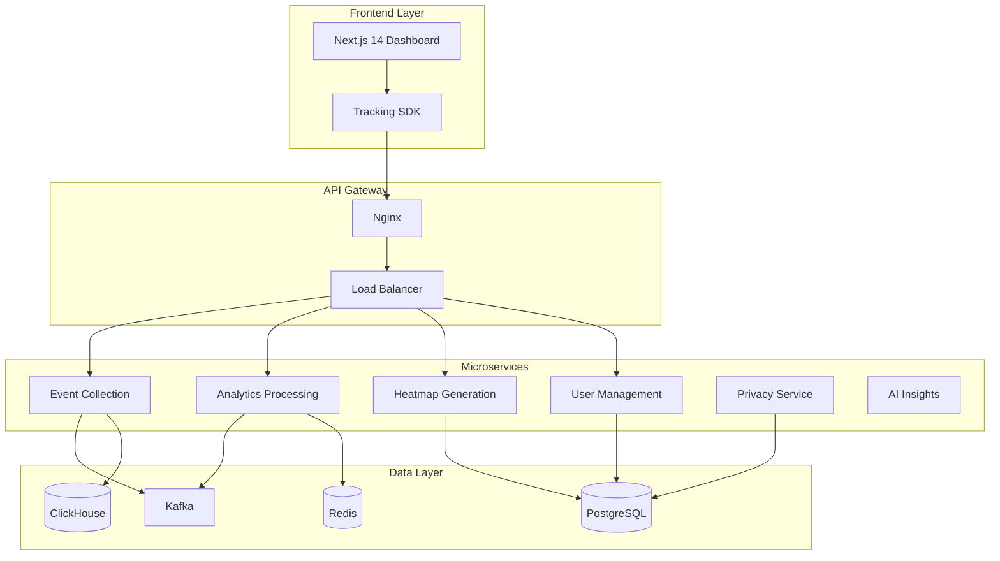

# 🔥 Enterprise Website Heatmap Analytics Platform

> **Production-Ready Analytics Platform** - Complete website heatmap and user behavior analytics SaaS solution built with enterprise-grade architecture and privacy-first design.

[](LICENSE)
[](package.json)
[](package.json)
[](docker-compose.yml)
[](infrastructure/k8s)

## 🎯 Platform Overview

**Enterprise-grade website heatmap and user behavior analytics platform** that provides visual insights into user interactions, conversion optimization, and UX improvement recommendations. Built to compete with industry leaders like Hotjar, Crazy Egg, and FullStory while maintaining privacy-first principles and affordable pricing.

### 🏆 Key Differentiators

- **🔒 Privacy-First Architecture** - Built-in GDPR/CCPA compliance with differential privacy
- **⚡ Real-Time Processing** - Sub-3-second heatmap generation with live updates
- **🎨 Canvas-Based Visualization** - High-performance heatmap rendering with interactive features
- **🤖 AI-Powered Insights** - ML-driven behavioral analysis and optimization recommendations
- **📱 Mobile-Optimized** - Full mobile dashboard with gesture tracking
- **🏢 Enterprise-Ready** - Multi-tenant architecture with team collaboration features

## 🏗️ Architecture Overview



## 🚀 Quick Start

### Prerequisites

- **Node.js 18+** and npm 8+
- **Docker** and Docker Compose
- **Git** for version control

### Development Setup

```bash
# 1. Clone the repository
git clone https://github.com/abdul712/MicroSaas-Ideas.git
cd MicroSaas-Ideas/website-heatmap-tool

# 2. Install dependencies
npm install

# 3. Setup environment
cp .env.example .env
# Edit .env with your configuration

# 4. Start infrastructure services
npm run docker:up

# 5. Run database migrations
npm run db:migrate

# 6. Start development servers
npm run dev
```

### 🔧 Available Services

| Service | Port | Description |
|---------|------|-------------|
| **Frontend** | 3000 | Next.js dashboard application |
| **Event Collection** | 3001 | High-throughput event ingestion |
| **Analytics Processing** | 3002 | Real-time data processing |
| **Heatmap Generation** | 3003 | Canvas-based visualization |
| **User Management** | 3004 | Authentication and billing |
| **Privacy Service** | 3005 | GDPR/CCPA compliance |
| **AI Insights** | 3006 | ML-powered recommendations |
| **Grafana** | 3007 | Monitoring dashboard |

## 📦 Project Structure

```
website-heatmap-tool/
├── frontend/                   # Next.js 14 dashboard application
│   ├── src/
│   │   ├── app/               # App Router pages
│   │   ├── components/        # Reusable UI components
│   │   ├── lib/              # Utilities and configurations
│   │   └── styles/           # Global styles and themes
│   └── public/               # Static assets
├── backend/                   # Microservices architecture
│   ├── event-collection/     # High-performance event ingestion
│   ├── analytics-processing/ # Real-time stream processing
│   ├── heatmap-generation/   # Canvas-based visualization
│   ├── user-management/      # Auth, billing, teams
│   ├── privacy-service/      # GDPR/CCPA compliance
│   └── ai-insights/          # ML-powered analysis
├── sdk/                      # Lightweight tracking SDK (<10KB)
│   ├── src/
│   │   ├── core/            # Event tracking core
│   │   ├── plugins/         # Feature plugins
│   │   └── utils/           # Helper utilities
│   └── dist/                # Compiled SDK builds
├── infrastructure/           # DevOps and deployment
│   ├── k8s/                 # Kubernetes manifests
│   ├── nginx/               # API Gateway configuration
│   ├── monitoring/          # Prometheus & Grafana
│   └── sql/                 # Database schemas
└── docs/                    # API documentation
    ├── api/                 # OpenAPI specifications
    └── guides/              # Integration guides
```

## 🎯 Core Features

### 📊 Multi-Type Heatmap Generation

- **Click Heatmaps** - Visual overlay showing interaction hotspots
- **Mouse Movement Tracking** - Hover patterns and attention mapping
- **Scroll Depth Analysis** - Content engagement visualization
- **Touch Gesture Tracking** - Mobile-specific interaction patterns
- **Form Analytics** - Field-level interaction insights

### 🎬 Session Replay & Analysis

- **Privacy-Protected Recordings** - Sensitive data masking
- **Rage Click Detection** - Frustration point identification
- **User Journey Mapping** - Complete interaction flows
- **Conversion Funnel Analysis** - Drop-off point visualization
- **Performance Impact Monitoring** - Zero-impact recording

### 🤖 AI-Powered Insights

- **Automated UX Issue Detection** - AI-identified problem areas
- **Conversion Optimization Suggestions** - Data-driven recommendations
- **User Pattern Recognition** - Behavioral clustering and analysis
- **Predictive Behavior Modeling** - Future interaction prediction
- **Personalization Opportunities** - Segment-based customization

### 🔒 Privacy & Compliance

- **GDPR/CCPA Compliant by Design** - Built-in privacy controls
- **Automatic PII Detection** - Sensitive data anonymization
- **Consent Management** - Granular tracking permissions
- **Data Retention Policies** - Configurable deletion workflows
- **Cross-Border Compliance** - Regional data protection

## ⚡ Performance Specifications

### 📈 Scale Capabilities

- **Event Processing**: 1M+ events per minute
- **Concurrent Sessions**: 10,000+ simultaneous users
- **Heatmap Generation**: Sub-3-second processing
- **Tracking Script**: <10KB gzipped, <50ms load time
- **Uptime**: 99.9% availability with auto-scaling

### 🔧 Technical Requirements

- **Database**: PostgreSQL 15+ for relational data
- **Analytics Store**: ClickHouse for time-series analytics
- **Cache Layer**: Redis 7+ for sessions and caching
- **Message Queue**: Apache Kafka for event streaming
- **Container Platform**: Docker + Kubernetes ready

## 🚀 Deployment Options

### Development Environment

```bash
# Docker Compose (Recommended for development)
npm run docker:up

# Manual setup
npm run setup:dev
npm run dev
```

### Production Deployment

```bash
# Kubernetes deployment
kubectl create namespace heatmap-analytics
npm run k8s:deploy

# Helm chart deployment
helm install heatmap-analytics ./infrastructure/helm/
```

### Cloud Platforms

- **AWS**: EKS with RDS, ElastiCache, MSK
- **GCP**: GKE with Cloud SQL, Memorystore, Pub/Sub
- **Azure**: AKS with PostgreSQL, Redis, Service Bus

## 📊 Monitoring & Observability

### Built-in Monitoring Stack

- **Prometheus** - Metrics collection and alerting
- **Grafana** - Visualization dashboards
- **Jaeger** - Distributed tracing
- **ELK Stack** - Centralized logging

### Key Metrics Tracked

- Event ingestion rate and latency
- Heatmap generation performance
- User session analytics
- API response times
- Database query performance
- Memory and CPU utilization

## 🧪 Testing Strategy

### Comprehensive Test Coverage

```bash
# Run all tests
npm run test

# Unit tests (90%+ coverage)
npm run test:unit

# Integration tests
npm run test:integration

# End-to-end tests
npm run test:e2e

# Performance tests
npm run test:performance
```

### Test Categories

- **Unit Tests**: Individual component testing
- **Integration Tests**: Service interaction testing
- **E2E Tests**: Complete workflow validation
- **Performance Tests**: Load and stress testing
- **Security Tests**: Vulnerability assessment

## 🔐 Security Features

### Multi-Layer Security

- **API Security**: Rate limiting, CORS, helmet.js
- **Authentication**: JWT with refresh tokens, OAuth 2.0
- **Data Protection**: Encryption at rest and in transit
- **Input Validation**: Comprehensive sanitization
- **OWASP Compliance**: Security best practices

### Privacy Controls

- **Data Anonymization**: Automatic PII detection and masking
- **Consent Management**: Granular tracking permissions
- **Right to be Forgotten**: GDPR deletion workflows
- **Data Portability**: Export user data functionality

## 📚 API Documentation

### RESTful API Design

```bash
# API documentation
npm run docs:serve

# OpenAPI specification
open http://localhost:3000/api-docs
```

### Key API Endpoints

- `POST /api/events` - Event collection endpoint
- `GET /api/heatmaps/{id}` - Heatmap data retrieval
- `GET /api/analytics/insights` - AI-powered insights
- `POST /api/auth/login` - User authentication
- `GET /api/sessions/{id}/replay` - Session replay data

## 🤝 Contributing

We welcome contributions! Please read our [Contributing Guide](CONTRIBUTING.md) for details on our code of conduct and submission process.

### Development Workflow

1. Fork the repository
2. Create a feature branch (`git checkout -b feature/amazing-feature`)
3. Commit changes (`git commit -m 'Add amazing feature'`)
4. Push to branch (`git push origin feature/amazing-feature`)
5. Open a Pull Request

## 📄 License

This project is licensed under the MIT License - see the [LICENSE](LICENSE) file for details.

## 🙏 Acknowledgments

- **Research**: Based on comprehensive analysis of industry leaders
- **Architecture**: Inspired by modern microservices patterns
- **Privacy**: Built with GDPR/CCPA compliance from day one
- **Performance**: Optimized for enterprise-scale deployments

---

**Built with ❤️ by the Heatmap Analytics Team**

For support, feature requests, or questions, please [open an issue](https://github.com/abdul712/MicroSaas-Ideas/issues) or contact our team.